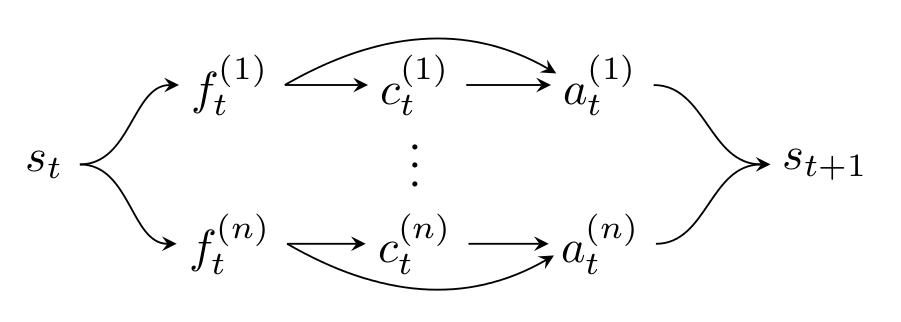

# 2016 ITSC Prob Drive

This repository accompanies "Analysis of Microscopic Behavior Models for Probabilistic Modeling of Driver Behavior," submitted to ITSC 2016.

## Features

The following features were used to train all driver models.

